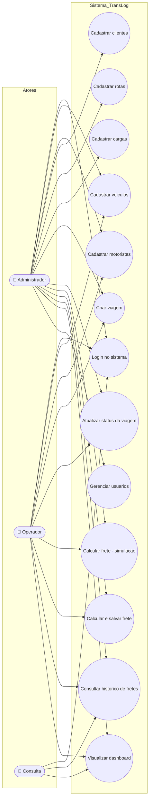

# Diagrama de Casos de Uso — TransLog

Atores e funcionalidades do sistema, conforme requisitos levantados pelo Diego e implementados no backend.

## Atores

| Ator | Perfil | Descrição |
|---|---|---|
| **Administrador** | `ADMIN` | Acesso total — gerencia usuários, configurações e todos os módulos |
| **Operador** | `OPERADOR` | Operação diária — cadastros, viagens, fretes (sem gestão de usuários) |
| **Consulta** | `CONSULTA` | Somente leitura — dashboard e histórico |

## Casos de uso principais

### UC07 — Criar viagem (fluxo principal)

**Ator:** Operador / Administrador

**Pré-condições:**
- Usuário autenticado
- Existem veículos com status `DISPONIVEL`, motoristas ativos, rotas e cargas cadastradas

**Fluxo principal:**
1. Operador acessa a aba "Viagens" e clica em "Nova Viagem"
2. Sistema exibe formulário com listas de veículos disponíveis, motoristas, rotas, cargas e clientes
3. Operador seleciona as opções e informa data de partida
4. Sistema valida:
   - Veículo está `DISPONIVEL` (regra do Leonardo)
   - Peso da carga ≤ capacidade do veículo (regra do Leonardo)
   - Rota existe (FK válida)
5. Sistema cria a viagem com status `PLANEJADA`
6. Sistema muda status do veículo para `EM_VIAGEM`
7. Sistema retorna confirmação

**Fluxos alternativos:**
- 4a. Veículo indisponível → exibe erro e cancela operação
- 4b. Peso excede capacidade → exibe erro com valores e cancela operação

### UC09 — Calcular frete (simulação)

**Ator:** qualquer perfil autenticado

**Pré-condições:** usuário autenticado

**Fluxo principal:**
1. Operador acessa a aba "Cálculo de Frete"
2. Informa distância (km), peso (kg), tipo de carga, pedágio e margem de lucro
3. Sistema aplica fórmula do `FreteService`:
   - Custo variável = (km × 2.50) + (km × 0.80) + (kg × 0.12) + pedágio
   - Valor = (CustoFixo + CustoVariavel) × MultiplicadorTipo × (1 + Margem/100)
4. Sistema retorna o valor calculado **sem persistir** (simulação)
5. Operador pode optar por "Calcular e Salvar" para gravar no histórico

## Rastreabilidade Requisitos → Casos de Uso

Conforme relatório do Diego (RFs e RNFs):

| Requisito | Caso de Uso | Status |
|---|---|---|
| RF01 — Cadastro de veículos | UC02 | ✅ Implementado |
| RF02 — Cadastro de motoristas | UC03 | ✅ Implementado |
| RF03 — Cadastro de rotas | UC05 | ✅ Implementado |
| RF04 — Cadastro de cargas | UC06 | ✅ Implementado |
| RF05 — Cadastro de clientes | UC04 | ✅ Implementado |
| RF06 — Criar viagem | UC07 | ✅ Implementado |
| RF07 — Atualizar status viagem | UC08 | ✅ Implementado |
| RF08 — Calcular frete | UC09, UC10 | ✅ Implementado |
| RF09 — Histórico de fretes | UC11 | ✅ Implementado |
| RF10 — Dashboard | UC12 | ✅ Implementado |
| RNF01 — Autenticação BCrypt | UC01 | ✅ Implementado |
| RNF02 — Resposta < 2s no cálculo | UC09 | ✅ Calculation in-memory |
| RNF03 — Responsividade mobile | (transversal) | ✅ CSS responsivo |
