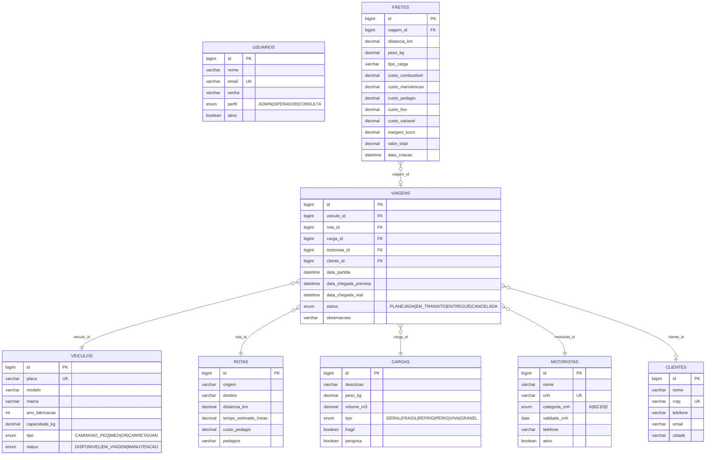

# DER — Diagrama Entidade-Relacionamento (TransLog)

Modelagem original: Gabriela Andrade Brito (RA 20240868)
Refinamento e consolidação: Pedro H. A. Marcandali (RA 20241595)

Gerado a partir de `transportadora_completo.sql`. Renderizar em https://mermaid.live ou no GitHub.

## Evolução da modelagem

| Versão | Autoria | Tabelas | Características |
|---|---|---|---|
| **Etapa 1** (`transportadora.sql`) | Gabriela | 5 | clientes, motoristas, veiculos, viagens, fretes — origem/destino inline na viagem |
| **Consolidada** (`transportadora_completo.sql`) | Gabriela + Pedro | 8 | + usuarios, rotas, cargas — normalização e FKs adequadas |

## Convenções

- **PK:** `id` BIGINT AUTO_INCREMENT em todas as tabelas (padrão JPA)
- **FK:** sufixo `_id` (ex: `veiculo_id`)
- **Charset:** utf8mb4 (suporte a emojis e acentuação)
- **Engine:** InnoDB (transações + foreign keys)
- **Senhas:** armazenadas com hash BCrypt (não há armazenamento em texto puro)
- **Índices:** criados em campos de busca frequente (email, cnpj, placa, status)

## Cardinalidades

- **Veículo : Viagem** = 1 : N (um veículo faz muitas viagens ao longo do tempo, mas só uma por vez)
- **Rota : Viagem** = 1 : N (a mesma rota é reutilizada por várias viagens)
- **Carga : Viagem** = 1 : N (cada viagem leva uma carga; carga pode reaparecer em outras)
- **Motorista : Viagem** = 1 : N
- **Cliente : Viagem** = 1 : N (opcional — viagem pode não ter cliente associado)
- **Viagem : Frete** = 1 : N (uma viagem pode ter múltiplas simulações de frete antes de fechar o valor)
