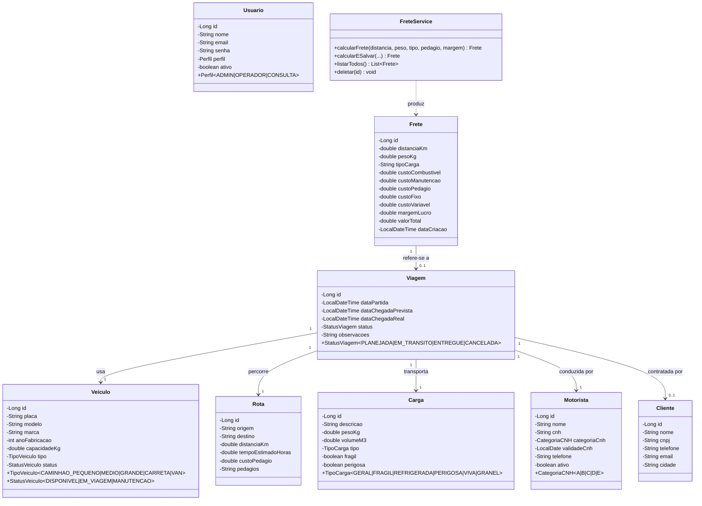

# Diagrama de Classes UML — TransLog

Diagrama gerado a partir das entidades JPA em `logistica-completo-reserva/src/main/java/com/transportadora/logistica/model/`.

Renderizar em: https://mermaid.live ou no GitHub diretamente.



## Relações principais

| Origem | Cardinalidade | Destino | Descrição |
|---|---|---|---|
| Viagem | N:1 | Veículo | Cada viagem usa um veículo (status muda para EM_VIAGEM) |
| Viagem | N:1 | Rota | Cada viagem percorre uma rota cadastrada |
| Viagem | N:1 | Carga | Cada viagem transporta uma carga |
| Viagem | N:1 | Motorista | Cada viagem é conduzida por um motorista |
| Viagem | N:0..1 | Cliente | Cliente é opcional (viagem interna pode não ter) |
| Frete | N:0..1 | Viagem | Frete pode ser calculado avulso (simulação) ou vinculado |

## Regras de negócio modeladas

Conforme módulo de Logística (Leonardo) — implementadas em `ViagemController.criar()`:

1. **Disponibilidade do veículo:** `veiculo.status == DISPONIVEL` antes de iniciar viagem
2. **Capacidade:** `carga.pesoKg <= veiculo.capacidadeKg`
3. **Rota válida:** referência a Rota cadastrada (FK)

Conforme módulo de Precificação (Vinícius) — implementado em `FreteService.calcularFrete()`:

```
ValorTotal = (CustoFixo + CustoVariavel) × MultiplicadorTipoCarga × (1 + MargemLucro/100)

CustoVariavel = (km × 2.50) + (km × 0.80) + (kg × 0.12) + pedagio
CustoFixo     = R$ 150.00
```

Multiplicadores: GRANEL 0.9 / GERAL 1.0 / FRAGIL 1.25 / REFRIGERADA 1.4 / VIVA 1.5 / PERIGOSA 1.6
