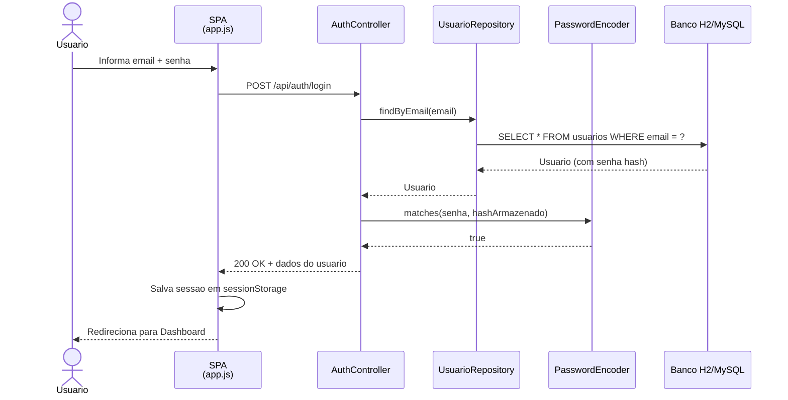
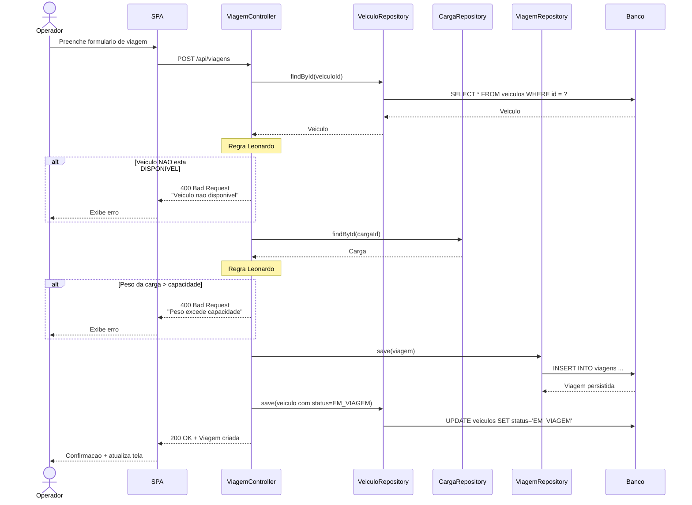
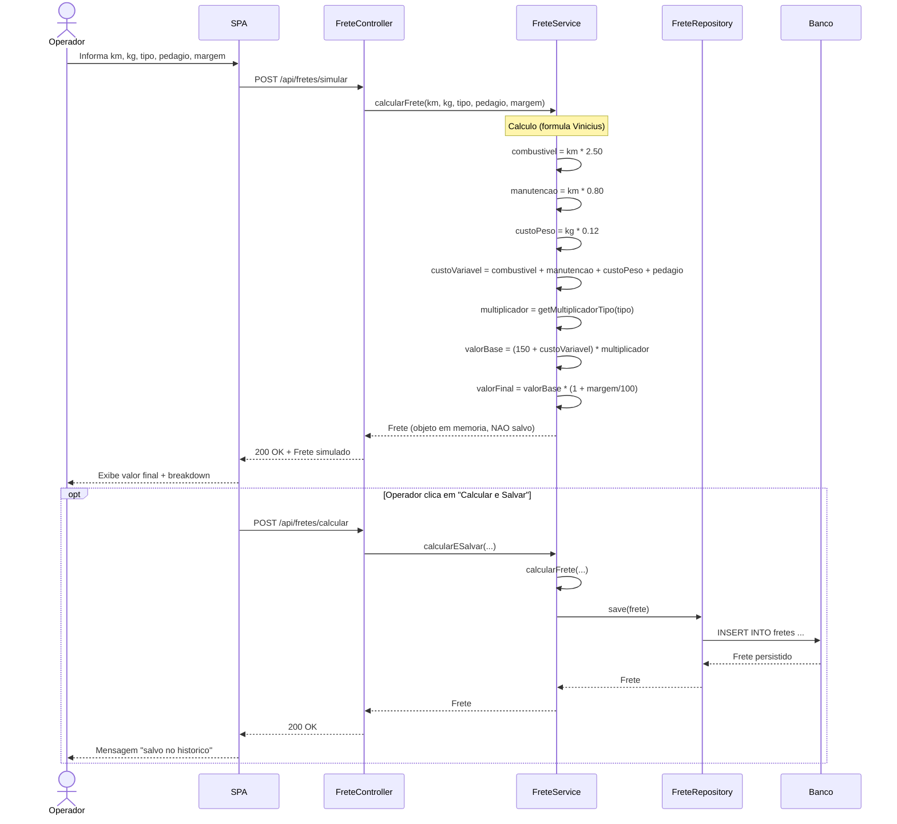

# Diagramas de Sequência — TransLog

Os três fluxos mais relevantes para a apresentação.

## 1. Autenticação (Login)

## 2. Criar viagem (com regras de negócio do Leonardo)

## 3. Calcular frete (regras do Vinícius)

## Observações

- Os controllers seguem padrão REST: GET (listar/buscar), POST (criar), PUT/PATCH (atualizar), DELETE (remover).
- Toda chamada do frontend usa `fetch()` com headers JSON.
- O backend retorna sempre JSON; códigos HTTP padrão (200, 400, 404, 500).
- Persistência via Spring Data JPA (Hibernate) — não há SQL manual nos controllers.
